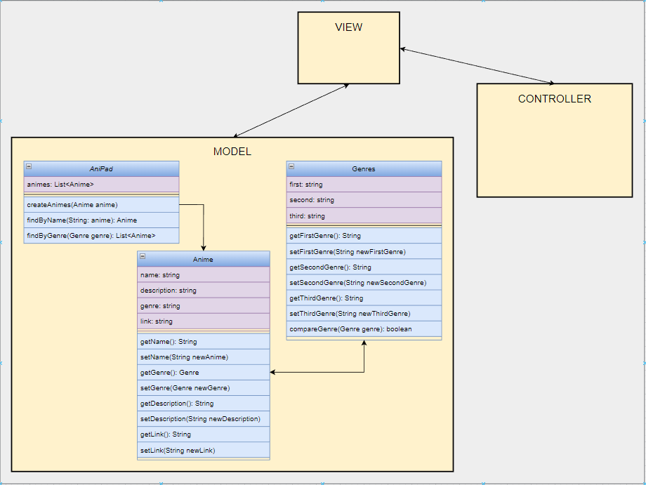
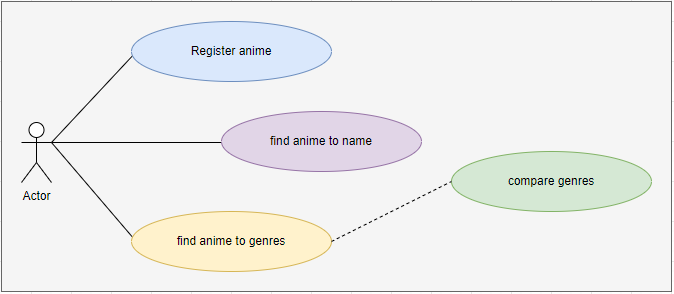

"We see three critical differences between programming and software engineering: time, scale, and the trade-offs at play. On a software engineering project, engineers need to be more concerned with the passage of time and the eventual need for change. In a software engineering organization, we need to be more concerned about scale and efficiency, both for the software we produce as well as for the organization that is producing it. Finally, as software engineers, we are asked to make more complex decisions with higher-stakes outcomes, often based on imprecise estimates of time and growth. Within Google, we sometimes say, “Software engineering is programming integrated over time.” Programming is certainly a significant part of software engineering: after all, programming is how you generate new software in the first place. If you accept this distinction, it also becomes clear that we might need to delineate between programming tasks (development) and software engineering tasks (development, modification, maintenance). The addition of time adds an important new dimension to programming. Cubes aren’t squares, distance isn’t velocity. Software engineering isn’t programming."

Titus Winters, Software Engineering at Google

### Conclusão:
##### Engenharia de software é o que mantém o sistema construído pelos desenvolvedores, em funcionamento ao longo dos anos. Fiscalizando e arquitetando todo o processo de criar e suportar o software, aplicando os princípios da engenharia na sua base de dados. Em suma, engenheiros de software usualmente instruem os desenvolvedores sobre o que o sistema deve ser, visando padrões de organização, performance, necessidade de mudança, entre outras coisas. Enquanto os desenvolvedores se dedicam exclusivamente em transformar estas instruções em código necessário para rodar o sistema.

# PROJECTS

## AniPad
### This project is a system for user save some animes that he likes for watch another time.

### Requirements

#### Functional:
##### - The user can register a anime that he likes.
##### - The user can search a anime for name.
##### - The user can search a anime group for genre.

#### Not-functional:
##### - View and execute responsively in diferents platforms
##### - Interface of simple access, utilization and view
##### - Application architecture with mvc model

### Class diagram

### Use cases diagram

